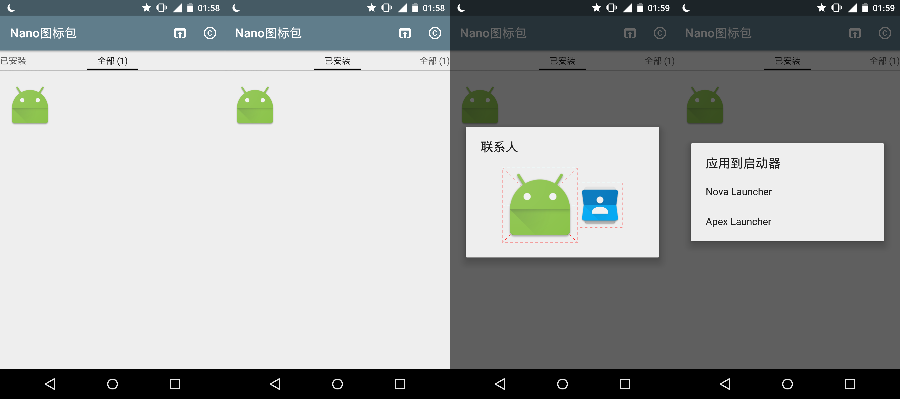
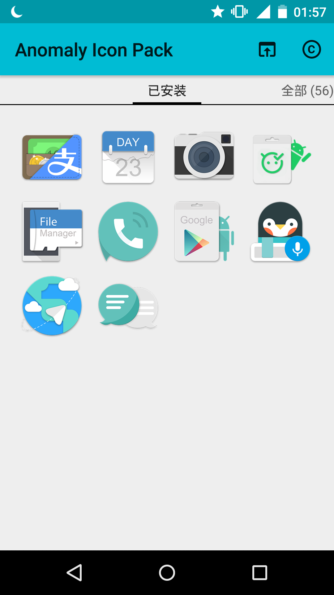
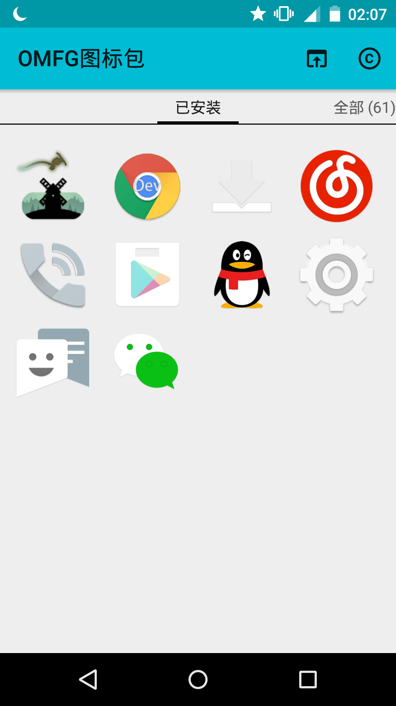

# Nano图标包 / Nano Icon Pack

Nano图标包是一个简单轻量的图标包模板，支持展示所有图标、过滤已安装图标、新原图标对比等功能。

您可以基于此进行二次开发，只需要装配图标、修改少量文件即可用于发布。

您还可以参考 [Jahir](https://github.com/jahirfiquitiva) 开发的更完备的图标包模板——[IconShowcase-Dashboard](https://github.com/jahirfiquitiva/IconShowcase-Dashboard)

### 支持启动器

目前支持活跃的两个启动器：
- Nova Launcher

- Apex Launcher

### 二次开发

TODO

### 应用

- Anomaly Icon Pack

- OMFG图标包

### License

    Copyright 2017 By_syk

    Licensed under the Apache License, Version 2.0 (the "License");
    you may not use this file except in compliance with the License.
    You may obtain a copy of the License at

       http://www.apache.org/licenses/LICENSE-2.0

    Unless required by applicable law or agreed to in writing, software
    distributed under the License is distributed on an "AS IS" BASIS,
    WITHOUT WARRANTIES OR CONDITIONS OF ANY KIND, either express or implied.
    See the License for the specific language governing permissions and
    limitations under the License.

*Copyright &#169; 2017 By_syk. All rights reserved.*