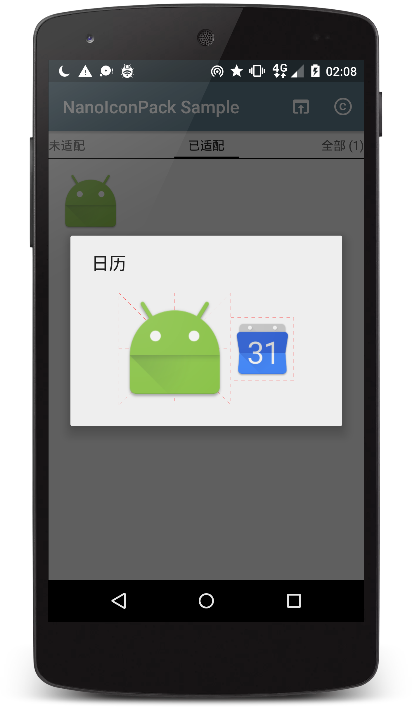

# NanoIconPack 图标包模板


NanoIconPack 是一个简单轻量的图标包模板，支持
+ 主页展示所有图标，按目标APP名（或图标名）拼音排序
+ 过滤展示已适配图标
+ 列出未适配APP，快速获取APP代码
+ 图标详情对话框，显示目标APP名（或图标名）、高清图标
+ 图标栅格
+ 新原图标对比显示
+ 直接应用到启动器、从支持的启动器设置中应用

相关截图（更多截图去[这里](art/)查看）：



您可以基于此进行二次开发，只需要装配图标、修改少量文件即可用于发布。

PS：NanoIconPack 只支持图标，如果您有更多需求，比如还需要支持壁纸、字体，还需要支持更多启动器，还需要更漂亮的 UI 等，可以参考 [Jahir](https://github.com/jahirfiquitiva) 开发并开源的图标包模板——[IconShowcase-Dashboard](https://github.com/jahirfiquitiva/IconShowcase-Dashboard)、[afollestad](https://github.com/afollestad) 开发并开源的图标包模板——[polar-dashboard](https://github.com/afollestad/polar-dashboard)。


### 支持启动器

目前支持以下5个广泛使用的启动器：

| Launcher | ICON |
| :---- | :----: |
| Nova Launcher |  |
| Apex Launcher |  |
| ADW Launcher |  |
| Aviate |  |
| Action 3 |  |

同时还支持许多未列出的启动器，比如 Holo Launcher、Xperia Home Launcher 等。


### 二次开发

+ 导入项目并配置

从 GitHub 导入 NanoIconPack 项目到 Android Studio，修改配置`build.gradle`：
```
android {
    defaultConfig {
        // Package name format: com.[your_name].iconpack.[name_of_your_icon_pack]
        applicationId "com.by_syk.iconpack.sample"
        versionCode 17013100
        // Version name format: [version].[num_of_icons]
        versionName "1.2.0.1"
    }
}
```

修改`/res/values/strings.xml`：
```
<string name="app_name">NanoIconPack Sample</string>

<!-- For Apex -->
<string name="developer_name">By_syk</string>

<string name="copyright_desc">"Icon pack author: [@By_syk](copy:@By_syk)
Donate via Alipay: [By_syk@163.com](copy:By_syk@163.com)
Copyright &#169; 2017 By_syk. All rights reserved."</string>
```

修改APP图标`/res/mipmap/ic_launcher.png`。

+ 装配图标

图标统一缩放`192`尺寸版本、规则命名后复制到`/res/drawable-nodpi/`文件夹。

> + 统一缩放？
>
>   `192*192`为最佳尺寸，`144*144`、`224*224`也是不错的选择，但非强制，只是注意别太大，太大会引起一些问题，比如在 Nova Launcher 中手动替换图标异常。
>
> + 规则命名？
>
>   小写字母+数字+`_`；不能数字打头；重名则照`_1`添加后缀。
>
> + \* 支持可选新特性
>
>   为在APP内展示图标时提供更好的视觉效果，您还可以为所有图标提供一个同名`384`尺寸版本，复制到`/res/mipmap-nodpi/`文件夹。
>
>   高清版本图标用途也仅限于此，不用于应用到桌面。

以“日历”APP为例，命名`calendar.png`，将`192`尺寸版本复制到`/drawable-nodpi/`、`384`版复制到`/mipmap-nodpi/`。

+ 登记图标

`/res/values/icon_pack.xml`中添加：
```
<!-- File name (no suffix) list of all icons in /res/drawable-nodpi/ -->
<string-array name="icons">
    <item>calendar</item>
</string-array>
<!-- Corresponding app name list of all icons in /res/drawable-nodpi/ -->
<!-- Just KEEP IT EMPTY BUT DO NOT DELETE IT if you do not want to collect app name list. -->
<string-array name="icon_labels">
    <item>Calendar</item>
</string-array>
```

`/res/xml/drawable.xml`中添加：
```
<category title="All" />
<item drawable="calendar" />
```

`/res/xml/appfilter.xml`中添加：
```
<!-- <item component="ComponentInfo{[package_name]/[launcher_activity_name]}" drawable="[icon_file_name]" /> -->
<item
    component="ComponentInfo{com.google.android.calendar/com.android.calendar.AllInOneActivity}"
    drawable="calendar" />
```


### 基于 NanoIconPack 的 APP

下载 Sample APP：[NanoIconPack Sample](https://github.com/by-syk/NanoIconPack/raw/master/out/com.by_syk.nanoiconpack.sample_v1.2.1.1.nightly(17020200).apk)

| APP | ICON |
| :---- | :----: |
| [@Childish / CoolDog Icon Pack <sub>old version</sub>](http://www.coolapk.com/apk/com.childish.cooldog) |  |
| [@ArchieLiu / 左下图标包](http://www.coolapk.com/apk/com.zuoxia.iconpack) |  |


### 使用开源项目和参考资料

NanoIconPack 使用了如下开源项目：
+ [lemann / pinyin4j](https://sourceforge.net/projects/pinyin4j/) licensed under [GPLv2](https://www.gnu.org/licenses/old-licenses/gpl-2.0.html)
+ [andraskindler / quickscroll](https://github.com/andraskindler/quickscroll) licensed under [Apache-2.0](http://www.apache.org/licenses/LICENSE-2.0)

参考了如下资料：
+ [IconShowcase](https://github.com/jahirfiquitiva/IconShowcase)
+ [[GUIDE] Apex Launcher Theme Tutorial](https://forum.xda-developers.com/showthread.php?t=1649891)


### 联系开发者

+ E-mail: [By_syk@163.com](mailto:By_syk@163.com "By_syk")
+ 酷安主页：[@By_syk](http://www.coolapk.com/u/463675)


### License

    Copyright 2017 By_syk

    Licensed under the Apache License, Version 2.0 (the "License");
    you may not use this file except in compliance with the License.
    You may obtain a copy of the License at

       http://www.apache.org/licenses/LICENSE-2.0

    Unless required by applicable law or agreed to in writing, software
    distributed under the License is distributed on an "AS IS" BASIS,
    WITHOUT WARRANTIES OR CONDITIONS OF ANY KIND, either express or implied.
    See the License for the specific language governing permissions and
    limitations under the License.


*Copyright &#169; 2017 By_syk. All rights reserved.*