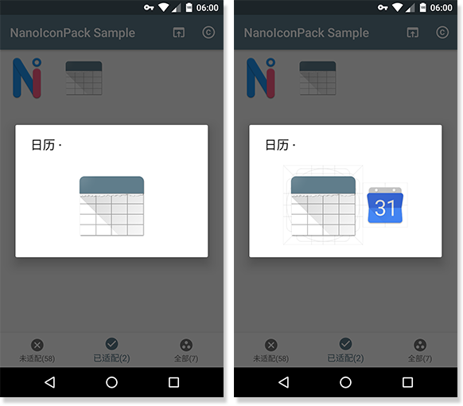
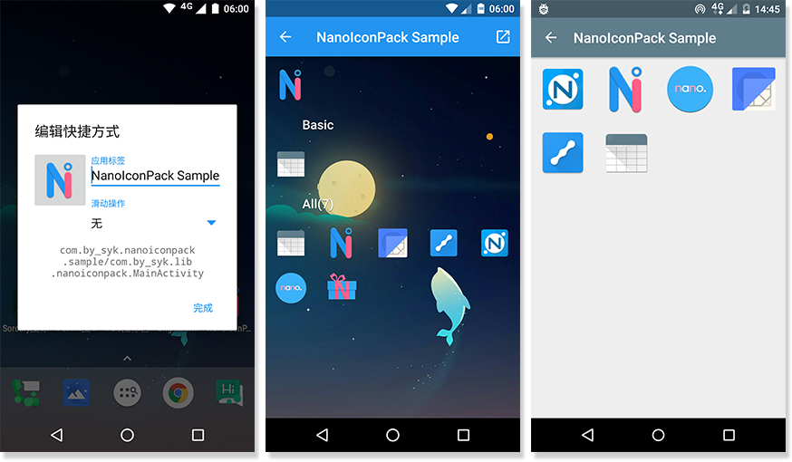
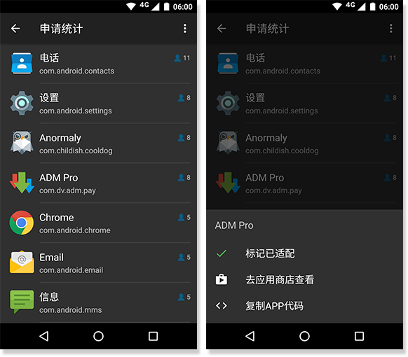
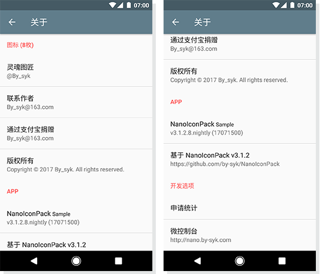
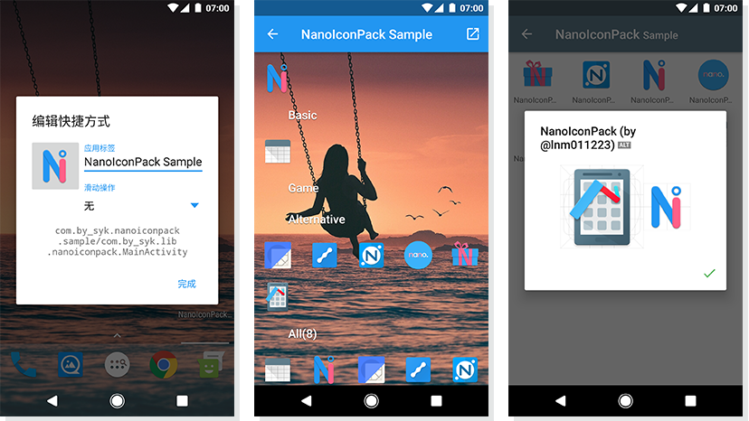
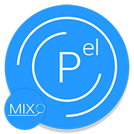
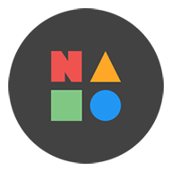
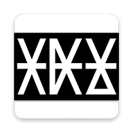

# NanoIconPack 图标包APP模板

[](#更新日志)
[](https://github.com/by-syk/NanoIconPack/releases/tag/3.0.0)
[](https://github.com/by-syk/NanoIconPack/raw/master/out/com.by_syk.nanoiconpack.sample_v3.0.0.8(17071400).apk)
[](https://github.com/by-syk/NanoIconPack/blob/master/LICENSE)


NanoIconPack 是一个简单轻量的图标包APP模板，支持主流启动器，**支持图标申请及统计**，并提供一些实用功能。

您可以基于此进行二次开发，只需要装配图标、修改少量文件（不涉及Java代码）即可打包出自己的图标包。


### 下文目录

+ [支持启动器](#支持启动器)
+ [实用功能](#实用功能)
+ [服务器支持](#服务器支持)
+ [二次开发](#二次开发)
+ [更新日志](#更新日志)

其他：
+ [基于 NanoIconPack 的 APP](#基于-nanoiconpack-的-app)
+ [致谢](#致谢)
+ [更好的图标包模板推荐](#更好的图标包模板推荐)
+ [联系开发者](#联系开发者)
+ [License](#license)


### 支持启动器

目前核心支持以下3个元老级的启动器：

| Launcher | ICON |
| :---- | :----: |
| Nova Launcher | [](https://www.coolapk.com/apk/com.teslacoilsw.launcher) |
| Apex Launcher | [](https://www.coolapk.com/apk/com.anddoes.launcher) |
| ADW Launcher | [](https://www.coolapk.com/apk/org.adw.launcher) |

这三个应该是启动器界的元老了（未考究），很多后来启动器沿用或支持它们的图标包规范。

NanoIconPack 同时还支持许多未列出的启动器，比如
+ Smart Launcher Pro
+ Action 3
+ Aviate
+ Holo Launcher
+ Arrow桌面
+ S桌面
+ Hola桌面
+ Go桌面
+ 冷桌面
+ 等……

以及一些系统默认启动器，比如
+ Xperia Home Launcher
+ 氢桌面
+ 等……

> 已知不支持并不打算支持：
> + ~~TSF桌面~~
> + ~~Atom桌面~~


### 实用功能

除了图标包最基本的功能外，我们还为 NanoIconPack 开发了一些有用的辅助功能。以下列举一二，更多请下载 Sample APP 体验。

+ 主界面三大页
  + 「已适配」：从全部图标中筛选出其对应APP已安装的部分列出
  + 「全部」：展示图标包内全部的图标
  + 「未适配」：从已安装的APP中筛选出无图标适配的部分列出
    + 支持一键提交适配申请
    + 支持复制APP代码（长按菜单中）
    + 支持保存APP图标（长按菜单中）
  
  

+ 图标查看
  + 栅格线叠加以了解边距等信息
  + 同时展示已安装APP的图标进行对比
  + 可替换的图标（为同一APP准备了多个图标，非默认的图标）进行**` ALT `**标记
  + 保存图标
  + 已适配的图标可一键发送到桌面（快捷方式形式）
  
  
  
+ 图标搜索
  
  支持按图标名、APP名或包名进行模糊搜索

  

+ 「更新了啥」页面展示每一版更新的图标

  
  
+ 图标申请适配统计
  + 可进行已适配/未适配标记
  + 可跳转应用商店查看
  + 可复制APP代码

  
  
  > 该界面默认不可见，进入方法：「关于」界面进入或双击主界面底栏的 **未适配** 图标

+ 版权描述
  + 作者
  + 联系方式
  + 捐赠渠道（支付宝直跳、微信二维码或其他）
  + 「申请统计」入口
  + 网页工具入口

  
  
+ 支持启动器的手动替换图标

  


### 服务器支持

NanoIconPack 拥有一个轻量的服务器，提供图标申请和申请统计两大服务。

详情请移步 [NanoIconPack 服务端项目](https://github.com/by-syk/NanoIconPackServer)了解。


### 二次开发

请移步 [:book: Wiki 页面](https://github.com/by-syk/NanoIconPack/wiki)查看二次开发步骤和相关开发帮助。


### 更新日志

当前开发中的版本日志：

```
- 图标搜索模块
- 支持保存未适配 APP 的图标
- 增强在复制代码时图标名的生成规则
- 使用更轻量高效的拼音解决方案 TinyPinyin 来替代 pinyin4j
- 「关于」新增「赞助支持」类
- 支持在「关于」中展示赞助者名单（需要在微控制台记录）
- ResInjection 工具升级，支持一次识别多图标导入
注意：/app 下 strings.xml 的内容变化
```

历史正式发布版本日志请移步[此处查看](out/changelog.txt)


### 基于 NanoIconPack 的 APP

| APP | ICON |
| :---- | :----: |
| [@atony](https://www.coolapk.com/u/474222) / [OriginalWish图标包 <sub>new version</sub>](https://www.coolapk.com/apk/com.atony.iconpack.originalwish) |  |
| [@pandecheng](https://www.coolapk.com/u/531994) / [PDC图标包 <sub>new version</sub>](https://www.coolapk.com/apk/com.pandecheng.iconpack) |  |
| [@大神sjk](https://www.coolapk.com/u/458995) / [Smalite图标包](https://www.coolapk.com/apk/com.sjk.smaliteiconpack) |  |
| [@可以and不行](https://www.coolapk.com/u/444646) / [Pelmix图标包](https://www.coolapk.com/apk/com.edward.iconpack.pelmix) |  |
| [@派大鑫](https://www.coolapk.com/u/511319) / [Party Star](https://www.coolapk.com/apk/com.paidax.iconpack.partystar) |  |
| [@CookDev](https://www.coolapk.com/u/315615) / [Cardicons Ⅱ 图标包 <sub>new version</sub>](https://www.coolapk.com/apk/cookdev.iconpack.ii) |  |
| [@Markuss](https://www.coolapk.com/u/529718) / [Aeroblast图标包](https://www.coolapk.com/apk/com.markusslugia.iconpack.aeroblast) |  |
| [@tsengyong](https://www.coolapk.com/u/931477) / [NoShadow图标包](https://www.coolapk.com/apk/com.tseng.iconpack.design) |  |
| [@ClydeSHenry](https://www.coolapk.com/u/609006) / [Galet IconPack](https://www.coolapk.com/apk/com.clydeshenry.iconpack.galet) |  |
| [@sftmi](https://www.coolapk.com/u/491391) / [OMFG图标包](https://www.coolapk.com/apk/com.sftmi.iconpack.omfg) |  |
| [@梁月丶](https://www.coolapk.com/u/620760) / [HHope](https://www.coolapk.com/apk/com.hhope.iconpack.ken) |  |
| [@LYCSKY497](https://www.coolapk.com/u/477979) / [LYCSKY图标包](https://www.coolapk.com/apk/com.lycsky.iconpack) |  |
| [@Laihz](https://www.coolapk.com/u/748141) / [迷之图标包](https://www.coolapk.com/apk/com.laihz.gradualiconpack.gamma) |  |
| [@gushixing](https://www.coolapk.com/u/991472) / [X-Flat图标包](https://www.coolapk.com/apk/com.wokee.xflat) |  |
| [@crazypig321](https://www.coolapk.com/u/940496) / [lineicons](https://www.coolapk.com/apk/com.crazypig321.lineicons2) |  |
| [@Trumeet](https://www.coolapk.com/u/543424) / [滑稽图标包 <sub>new version</sub>](https://www.coolapk.com/apk/kh.android.funnyiconpack) |  |
| [@lmn011223](https://www.coolapk.com/u/515642) / [萤火虫图标包](https://www.coolapk.com/apk/com.lnm011223.iconpack.fireflies) |  |
| [@森雨Plus](https://www.coolapk.com/u/533268) / [Pure 图标包](https://www.coolapk.com/apk/me.morirain.dev.iconpack.pure) |  |
| [@scrymille](https://www.coolapk.com/u/423612) / [预览图标包](https://www.coolapk.com/apk/com.scrymile.iconpack.yulan) |  |
| [@杨_懒懒](https://www.coolapk.com/u/1025623) / [Comb](https://www.coolapk.com/apk/com.lanlan.combiconpack) |  |

如果您基于 NanoIconPack 开发了自己的图标包作品并且愿意[告诉我](#联系开发者)，我将把它展示在这里。


### 致谢

致敬开源！NanoIconPack 使用了如下开源项目：
+ [promeG / TinyPinyin](https://github.com/promeG/TinyPinyin) licensed under [Apache-2.0](http://www.apache.org/licenses/LICENSE-2.0)
+ [fython / AlipayZeroSdk](https://github.com/fython/AlipayZeroSdk) licensed under [Apache-2.0](http://www.apache.org/licenses/LICENSE-2.0)
+ [kenglxn / QRGen](https://github.com/kenglxn/QRGen) licensed under [Apache-2.0](http://www.apache.org/licenses/LICENSE-2.0)
+ [square / retrofit](https://github.com/square/retrofit) licensed under [Apache-2.0](http://www.apache.org/licenses/LICENSE-2.0)
+ [bumptech / glide](https://github.com/bumptech/glide) licensed under [BSD, part MIT and Apache-2.0](https://github.com/bumptech/glide/blob/master/LICENSE)
+ [timusus / RecyclerView-FastScroll](https://github.com/timusus/RecyclerView-FastScroll) licensed under [Apache-2.0](http://www.apache.org/licenses/LICENSE-2.0)
+ [sjwall / MaterialTapTargetPrompt](https://github.com/sjwall/MaterialTapTargetPrompt) licensed under [Apache-2.0](http://www.apache.org/licenses/LICENSE-2.0)
+ [81813780 / AVLoadingIndicatorView](https://github.com/81813780/AVLoadingIndicatorView) licensed under [Apache-2.0](http://www.apache.org/licenses/LICENSE-2.0)

NanoIconPack 参考了如下资料：
+ [teslacoil / Example_NovaTheme](https://github.com/teslacoil/Example_NovaTheme)
+ [[GUIDE] Apex Launcher Theme Tutorial](https://forum.xda-developers.com/showthread.php?t=1649891)
+ [IconShowcase](https://github.com/jahirfiquitiva/IconShowcase)
+ [酷安开源版](https://github.com/bjzhou/Coolapk)

感谢伴随 NanoIconPack 开发过程的一群小伙伴们，他们来自酷安，提出了很多建设性建议：
+ [@ArchieLiu](https://www.coolapk.com/u/801526)
+ [@atony](https://www.coolapk.com/u/474222)
+ [@Childish](https://www.coolapk.com/u/596651)
+ [@CookDev](https://www.coolapk.com/u/315615)
+ [@hk流星](https://www.coolapk.com/u/555883)
+ [@可以and不行](https://www.coolapk.com/u/444646)
+ [@Markuss](https://www.coolapk.com/u/529718)
+ [@pandecheng](https://www.coolapk.com/u/531994)
+ [@sftmi](https://www.coolapk.com/u/491391)
+ 等……


### 更好的图标包模板推荐

NanoIconPack 追求简单轻量，只支持图标，如果您有更多需求，比如还需要支持壁纸、字体，还需要支持更多启动器，还需要更漂亮的 UI 等，可以参考以下开源项目：

| Dashboard | ICON |
| :---- | :----: |
| [jahirfiquitiva / IconShowcase-Dashboard](https://github.com/jahirfiquitiva/IconShowcase-Dashboard) |  |
| [afollestad / polar-dashboard](https://github.com/afollestad/polar-dashboard) |  |
| [danimahardhika / candybar-library](https://github.com/danimahardhika/candybar-library) |  |


### 联系开发者

+ E-mail: [By_syk@163.com](mailto:By_syk@163.com "By_syk")
+ 酷安主页：[@By_syk](https://www.coolapk.com/u/463675)


### License

    Copyright 2017-2018 By_syk

    Licensed under the Apache License, Version 2.0 (the "License");
    you may not use this file except in compliance with the License.
    You may obtain a copy of the License at

       http://www.apache.org/licenses/LICENSE-2.0

    Unless required by applicable law or agreed to in writing, software
    distributed under the License is distributed on an "AS IS" BASIS,
    WITHOUT WARRANTIES OR CONDITIONS OF ANY KIND, either express or implied.
    See the License for the specific language governing permissions and
    limitations under the License.


*Copyright &#169; 2017-2018 By_syk. All rights reserved.*