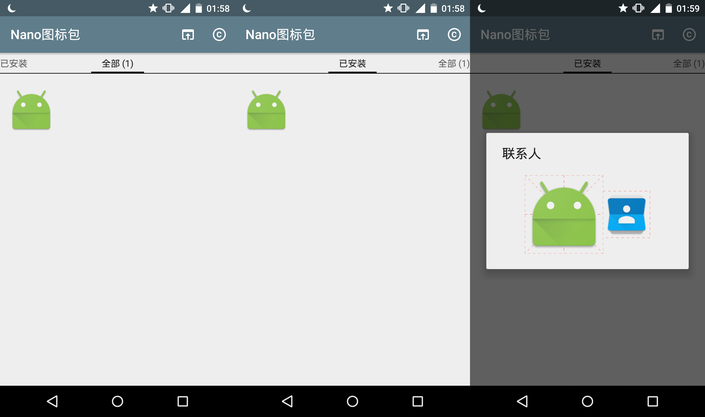
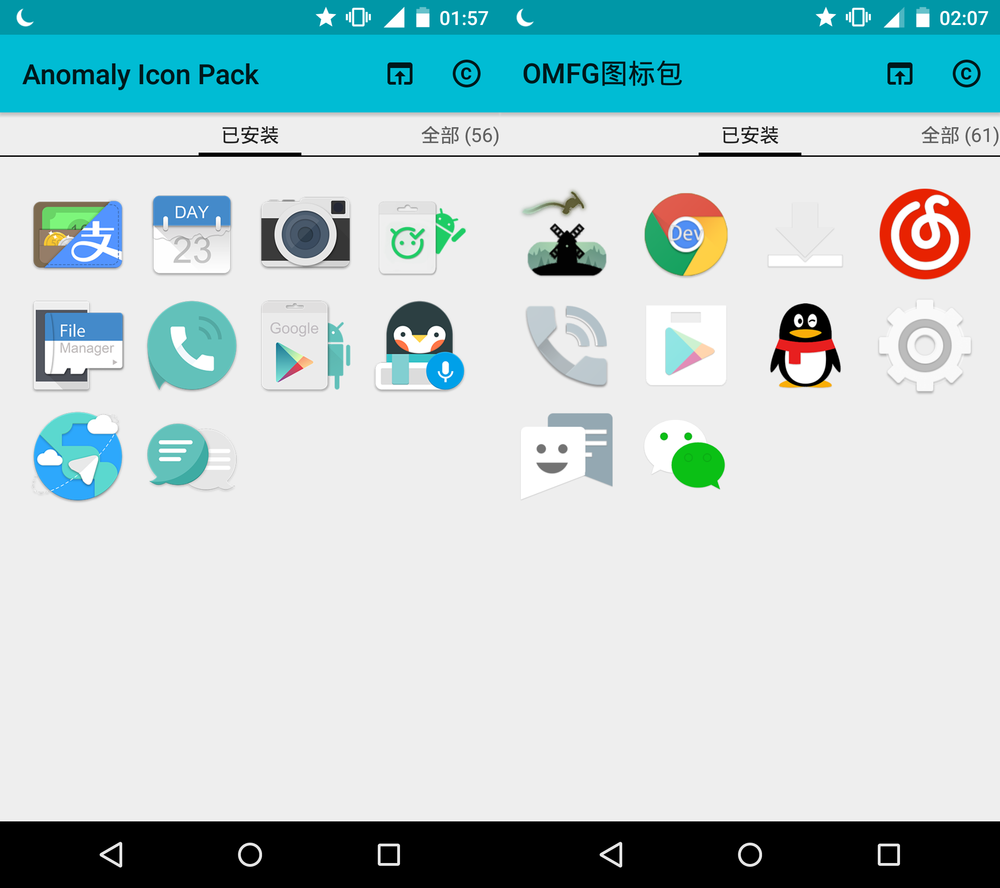

# Nano图标包 / Nano Icon Pack


Nano图标包是一个简单轻量的图标包模板，支持展示所有图标、过滤已安装图标、新原图标对比等功能。



您可以基于此进行二次开发，只需要装配图标、修改少量文件即可用于发布。

您还可以参考 [Jahir](https://github.com/jahirfiquitiva) 开发的更完备的图标包模板——[IconShowcase-Dashboard](https://github.com/jahirfiquitiva/IconShowcase-Dashboard)。


### 支持启动器

目前仅支持最活跃的两个启动器：

| 启动器 | 图标 |
| :---- | :----: |
| Nova Launcher |  |
| Apex Launcher |  |

图标包应用到启动器、从启动器应用图标包均可。


### 二次开发

- 导入项目

从 GitHub 导入 NanoIconPack 项目到 Android Studio，修改包名（可在原包名`com.by_syk.nanoiconpack`后追加`.[author_of_icons]`）。
```
android {
    defaultConfig {
        applicationId "com.by_syk.nanoiconpack.[author_of_icons]"
    }
}
```

- 装配图标

图标规则命名后复制到`/res/drawable-nodpi/`文件夹。

参考命名规则：小写字母+数字+`_`；不能数字打头；重名照`_1`添加后缀。

- 登记图标

- TODO To be continued...


### 应用

| APP | 图标 |
| :---- | :----: |
| Anomaly Icon Pack |  |
| OMFG图标包 |  |




### 参考

- [[GUIDE] Apex Launcher Theme Tutorial](https://forum.xda-developers.com/showthread.php?t=1649891)


### License

    Copyright 2017 By_syk

    Licensed under the Apache License, Version 2.0 (the "License");
    you may not use this file except in compliance with the License.
    You may obtain a copy of the License at

       http://www.apache.org/licenses/LICENSE-2.0

    Unless required by applicable law or agreed to in writing, software
    distributed under the License is distributed on an "AS IS" BASIS,
    WITHOUT WARRANTIES OR CONDITIONS OF ANY KIND, either express or implied.
    See the License for the specific language governing permissions and
    limitations under the License.


*Copyright &#169; 2017 By_syk. All rights reserved.*