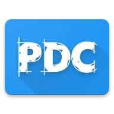

# NanoIconPack 图标包APP模板

.apk)

NanoIconPack 是一个简单轻量的图标包APP模板，支持
+ 主页展示所有图标，按目标APP名（或图标名）拼音排序
+ 过滤展示已适配图标
+ 列出未适配APP，快速获取APP代码
+ 图标详情对话框，显示目标APP名（或图标名）、高清图标
+ 图标栅格
+ 新原图标对比显示
+ 快速保存图标
+ 直接应用到启动器、从支持的启动器设置中应用

相关截图（更多截图去[这里](art/SCREENSHOTS.md)查看）：

您可以基于此进行二次开发，只需要装配图标、修改少量文件即可用于发布。

### 支持启动器

目前支持以下5个广泛使用的启动器：

| Launcher | ICON |
| :---- | :----: |
| Nova Launcher |  |
| Apex Launcher |  |
| ADW Launcher |  |
| Aviate |  |
| Action 3 |  |

同时还支持许多未列出的启动器，比如 Holo Launcher、Xperia Home Launcher 等。

### 二次开发

去 [:book: Wiki](https://github.com/by-syk/NanoIconPack/wiki/%E4%BA%8C%E6%AC%A1%E5%BC%80%E5%8F%91%E6%AD%A5%E9%AA%A4) 页面查看二次开发步骤。

### 基于 NanoIconPack 的 APP

| APP | ICON |
| :---- | :----: |
| [@Childish / Anormaly old version](http://www.coolapk.com/apk/com.childish.cooldog) |  |
| [@ArchieLiu / 左下图标包 old version](http://www.coolapk.com/apk/com.zuoxia.iconpack) |  |
| [@pandecheng / PDC图标包 new version](http://www.coolapk.com/apk/com.pandecheng.iconpack) |  |
| [@sftmi / OMFG图标包](http://www.coolapk.com/apk/com.sftmi.iconpack.omfg) |  |
| [@大神sjk / Smalite图标包](http://www.coolapk.com/apk/com.sjk.smaliteiconpack) |  |
| [@派大鑫 / Party Star](http://www.coolapk.com/apk/com.paidax.iconpack.partystar) |  |
| [@Markuss / Aeroblast图标包](http://www.coolapk.com/apk/com.markusslugia.iconpack.aeroblast) |  |

如果您基于 NanoIconPack 开发出了自己的图标包作品，请不吝[知会我](#联系开发者)，以便展示在这里。

### 使用开源项目和参考资料

NanoIconPack 使用了如下开源项目：
+ [Li Min / pinyin4j](https://sourceforge.net/projects/pinyin4j/) licensed under [GPLv2](https://www.gnu.org/licenses/old-licenses/gpl-2.0.html)
+ [andraskindler / quickscroll](https://github.com/andraskindler/quickscroll) licensed under [Apache-2.0](http://www.apache.org/licenses/LICENSE-2.0)

参考了如下资料：
+ [IconShowcase](https://github.com/jahirfiquitiva/IconShowcase)
+ [[GUIDE] Apex Launcher Theme Tutorial](https://forum.xda-developers.com/showthread.php?t=1649891)

### 更好的图标包模板

NanoIconPack 追求简单轻量，只支持图标，如果您有更多需求，比如还需要支持壁纸、字体，还需要支持更多启动器，还需要更漂亮的 UI 等，可以参考以下开源项目：

| Dashboard | ICON |
| :---- | :----: |
| [jahirfiquitiva / IconShowcase-Dashboard](https://github.com/jahirfiquitiva/IconShowcase-Dashboard) |  |
| [afollestad / polar-dashboard](https://github.com/afollestad/polar-dashboard) |  |
| [danimahardhika / candybar-library](https://github.com/danimahardhika/candybar-library) |  |

### 联系开发者

+ E-mail: [By_syk@163.com](mailto:By_syk@163.com "By_syk")
+ 酷安主页：[@By_syk](http://www.coolapk.com/u/463675)

### License

    Copyright 2017 By_syk

    Licensed under the Apache License, Version 2.0 (the "License");
    you may not use this file except in compliance with the License.
    You may obtain a copy of the License at

       http://www.apache.org/licenses/LICENSE-2.0

    Unless required by applicable law or agreed to in writing, software
    distributed under the License is distributed on an "AS IS" BASIS,
    WITHOUT WARRANTIES OR CONDITIONS OF ANY KIND, either express or implied.
    See the License for the specific language governing permissions and
    limitations under the License.

*Copyright &#169; 2017 By_syk. All rights reserved.*