| APP截图 | APP截图 |
| :--: | :--: |
| “已适配”页面，在已安装的APP里过滤显示已适配的图标 | “全部”页面，显示所有图标 |
| 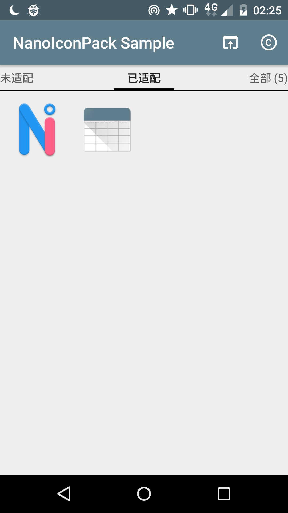 | 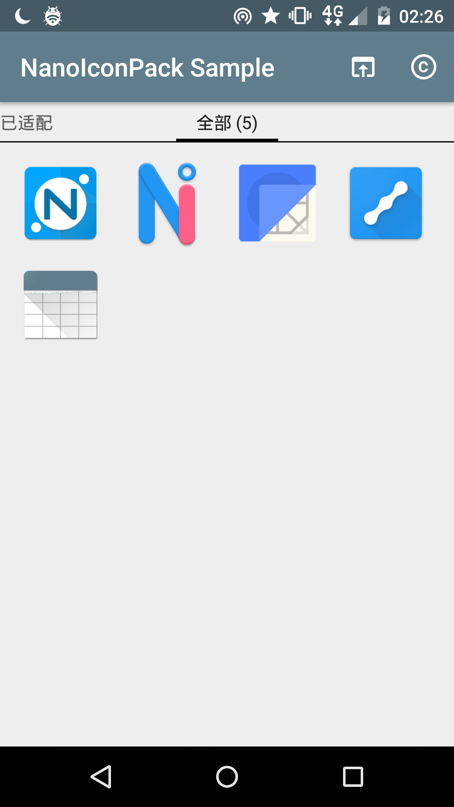 |
| 图标详情对话框 | 图标详情对话框（对比模式） |
| 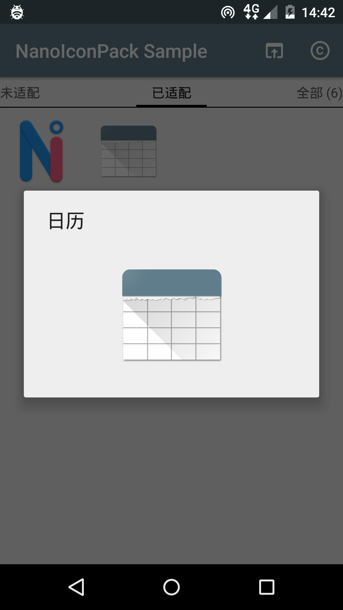 | 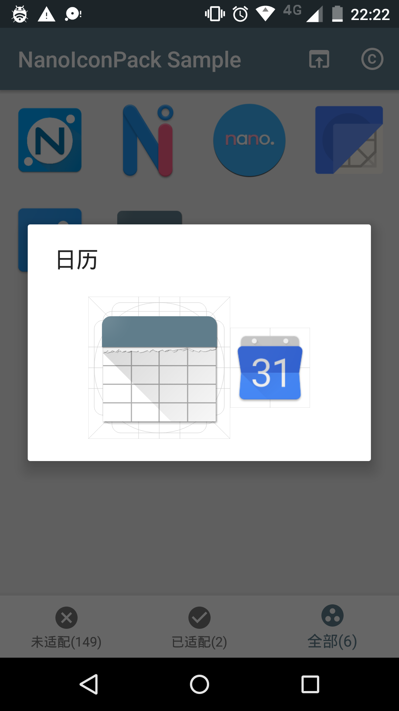 |
| “未适配”页面，列出未适配图标的APP | 应用到启动器对话框，提供几个典型启动器供快速应用，其他启动器则到其设置中应用 |
| 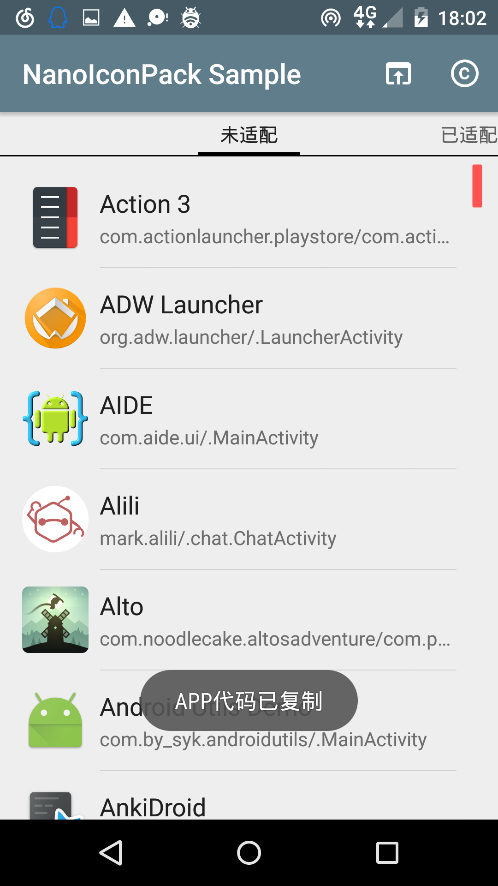 | 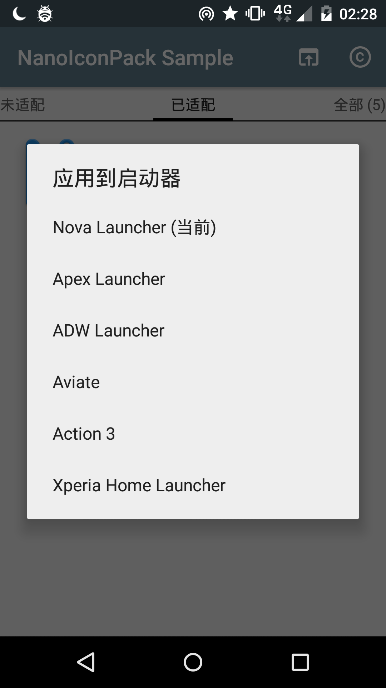 |
| 关于界面，描述图标和APP相关信息 | 手动替换选择图标页面 |
| 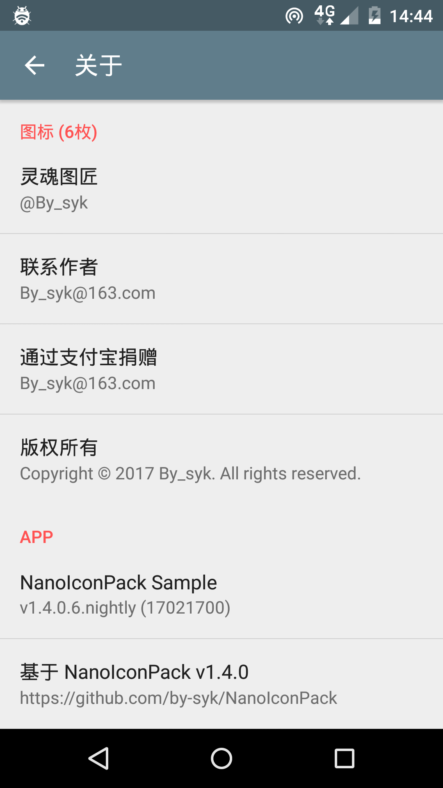 |  |

| 启动器截图 | 启动器截图 |
| :--: | :--: |
| 从 Nova Launcher 应用图标包 | 从 Nova Launcher 手动替换图标包 |
| 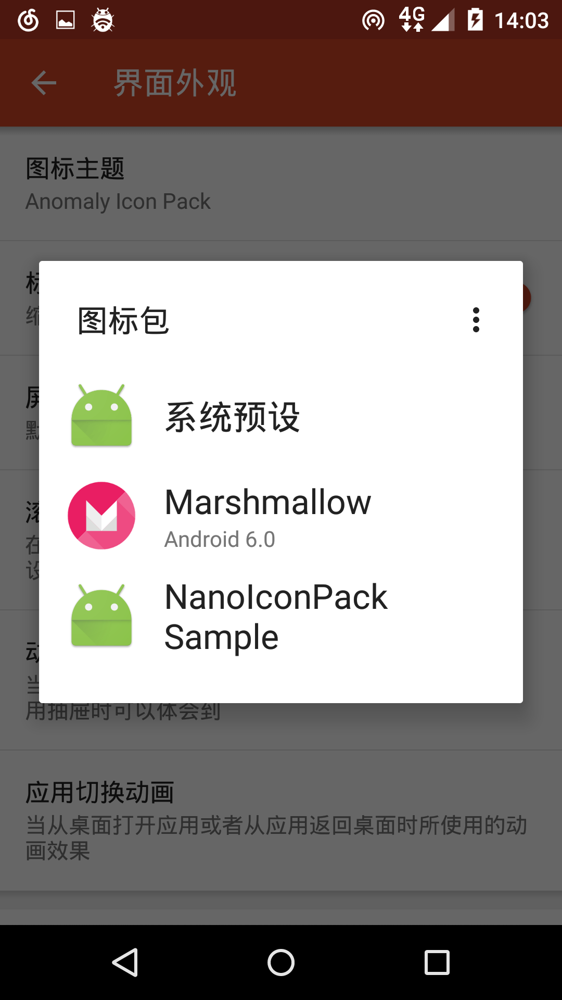 | 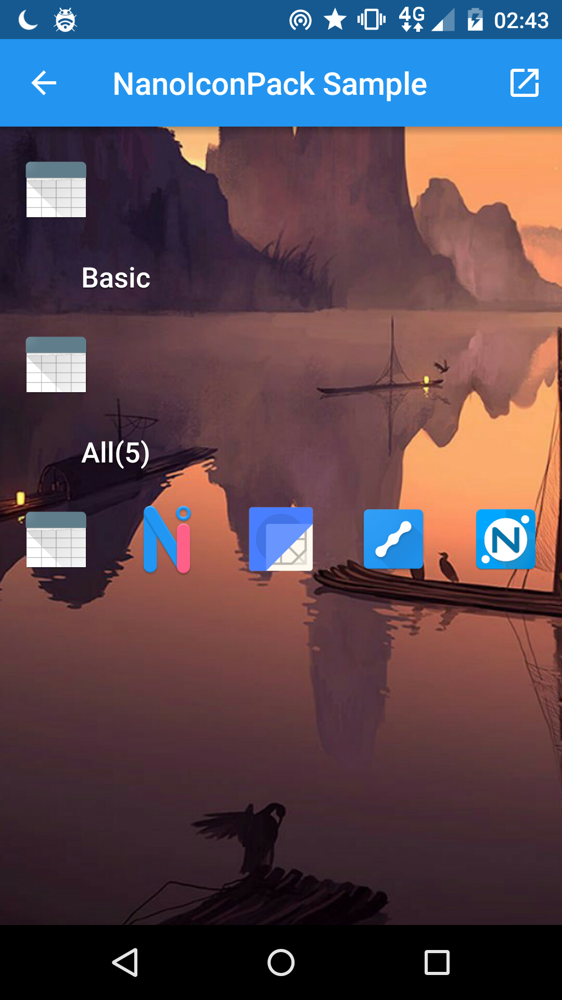 |
| 从 Apex Launcher 应用图标包 | 从 ADW Launcher 应用图标包 |
|  | 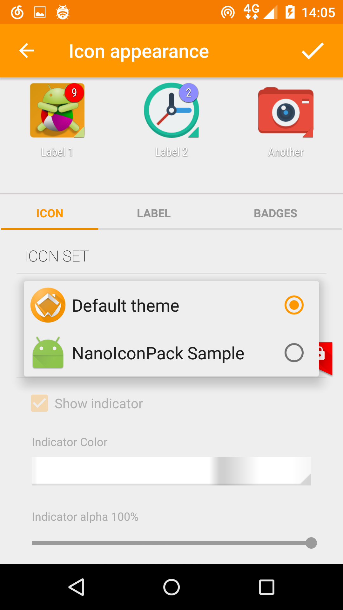 |
| 从 Action 3 Launcher 应用图标包 | |
| 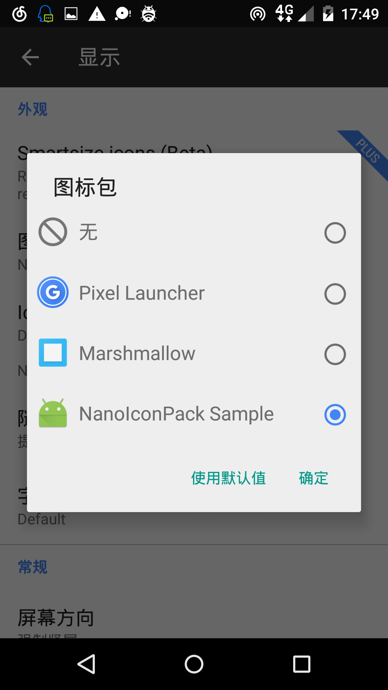 |