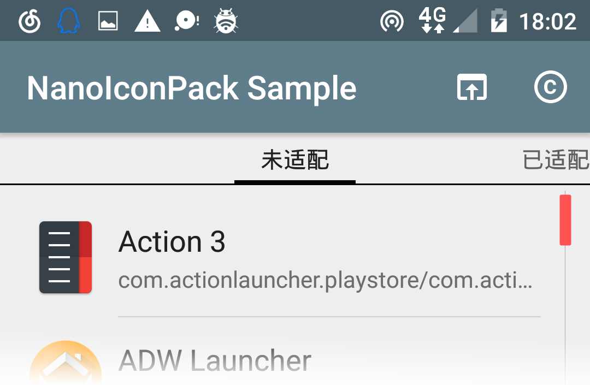

### 二次开发

+ 导入项目并配置

从 GitHub 导入 NanoIconPack 项目到 Android Studio。项目根目录有两个核心子目录：`./nanoiconpack/`为库代码，`./app/`为 Sample APP 代码。一般情况下，只需要改动`app`的代码即可，`nanoiconpack` 不需要修改。以下步骤也只会涉及到改动`app`。

修改配置`build.gradle`：
```
android {
    defaultConfig {
        // Package name format: com.[your_name].iconpack.[name_of_your_icon_pack]
        applicationId "com.by_syk.iconpack.sample"
        versionCode 17013100
        // Version name format: [version].[num_of_icons]
        versionName "1.2.0.1"
    }
}
```

修改`/res/values/strings.xml`：
```
<string name="app_name">NanoIconPack Sample</string>

<!-- For Apex -->
<string name="developer_name">By_syk</string>

<string name="copyright_desc">"Icon pack author: [@By_syk](copy:@By_syk)
Donate via Alipay: [By_syk@163.com](copy:By_syk@163.com)
Copyright &#169; 2017 By_syk. All rights reserved."</string>
```

修改APP图标`/res/mipmap/ic_launcher.png`。

+ 装配图标

图标统一缩放`192`尺寸版本、规则命名后复制到`/res/drawable-nodpi/`文件夹。

> + 统一缩放？
>
>   `192*192`为最佳尺寸，`144*144`、`224*224`也是不错的选择，但非强制，只是注意别太大，太大会引起一些问题，比如在 Nova Launcher 中手动替换图标异常。
>
> + 规则命名？
>
>   允许小写字母+数字+`_`；不能数字打头；重名则照`_1`添加后缀。非法例：`Calendar.png`、`500px.png`。
>
> + \* 支持可选新特性
>
>   为在APP内展示图标时提供更好的视觉效果，您还可以为所有图标提供一个同名`384`尺寸版本，复制到`/res/mipmap-nodpi/`文件夹。
>
>   高清版本图标用途也仅限于此，不用于应用到桌面。

以“日历”APP为例，命名`calendar.png`，将`192`尺寸版本复制到`/drawable-nodpi/`、`384`版复制到`/mipmap-nodpi/`。

+ 登记图标

修改`/res/values/icon_pack.xml`，该文件记录了全部图标的文件名及其目标APP的应用名。添加：
```
<!-- File name (no suffix) list of all icons in /res/drawable-nodpi/ -->
<string-array name="icons">
    <item>calendar</item>
</string-array>
<!-- Corresponding app name list of all icons in /res/drawable-nodpi/ -->
<!-- Just KEEP IT EMPTY BUT DO NOT DELETE IT if you do not want to collect app name list. -->
<string-array name="icon_labels">
    <item>Calendar</item>
</string-array>
```

修改`/res/xml/drawable.xml`，该文件用于为 Nova 等启动器提供手选图标列表。添加：
```
<category title="Base" /><!-- Base icons here -->
<item drawable="calendar" />

<category title="Other" /><!-- Other icons here -->
```

修改`/res/xml/appfilter.xml`，该文件定义了图标与目标APP之间的匹配关系，启动器据此自动为所有APP替换图标。添加：
```
<!-- <item component="ComponentInfo{[package_name]/[launcher_activity_name]}" drawable="[icon_file_name]" /> -->
<item
    component="ComponentInfo{com.google.android.calendar/com.android.calendar.AllInOneActivity}"
    drawable="calendar" />
```

> + 如何获取APP的包名和 Launcher Activity 这两个参数？
>
>   Sample APP 已经提供了这个功能，用于快速获取已安装APP的代码。
>
>   